# 基于 Spring Boot 与 React 的类 Discord 实时通信平台的设计与实现

**摘要**：随着互联网社区规模不断扩大，人们对跨平台实时沟通工具的需求日益增长。Discord 作为全球流行的社区沟通平台，其核心功能涵盖文字聊天、语音通话、群组权限管理、好友系统与私信等，具有较高的工程复杂度与学习价值。本文设计并实现了一个类 Discord 的实时通信平台，后端采用 Spring Boot 3.2 框架，结合 Spring Security 实现基于 JWT 的无状态认证，通过自研 64 位权限引擎完成细粒度的群组与频道权限控制；前端采用 React 18 + TypeScript + Vite 构建单页应用，基于 WebSocket 实现消息、状态与语音的实时推送。系统实现了账号注册登录、邮箱验证、两步验证、好友关系、群组与频道管理、消息增删改查与搜索、表情回应、邀请与封禁、审计日志、文件附件上传、实时语音中继与音视频通话（摄像头/屏幕共享）等功能。针对实际工程中常见的越权访问、接口枚举、文件伪造、搜索注入等安全问题，本文进行了系统的安全加固，并建立了覆盖后端与前端共 68 个自动化测试用例的回归测试体系。测试结果表明，系统功能完整、权限校验严格、运行稳定，达到了预期的设计目标。

**关键词**：实时通信；Spring Boot；React；WebSocket；JWT；权限控制

---

## Abstract

With the continuous expansion of Internet communities, the demand for cross-platform real-time communication tools has been growing rapidly. Discord, one of the most popular community communication platforms, integrates text chat, voice channels, group permission management, friend relationships, and direct messaging, which makes it a representative subject of high engineering complexity and learning value. This thesis designs and implements a Discord-like real-time communication platform. The back end is built on Spring Boot 3.2 and Spring Security, adopting stateless authentication based on JSON Web Token (JWT), together with a self-developed 64-bit permission engine that provides fine-grained access control over guilds and channels. The front end is a single-page application developed with React 18, TypeScript, and Vite, which receives real-time pushes of messages, presence states, and voice events over WebSocket. The system implements account registration and login, e-mail verification, two-factor authentication, friend relationships, guild and channel management, message CRUD and search, emoji reactions, invites and bans, audit logging, file attachment upload, and real-time voice relaying. To address security problems frequently observed in practical engineering, such as unauthorized access, data enumeration, file forgery, and search injection, a systematic security hardening was performed, and a regression test suite consisting of 63 automated test cases covering both the back end and the front end was established. Test results show that the system is functionally complete, strictly authorized, and stably operating, achieving the expected design goals.

**Keywords**: real-time communication; Spring Boot; React; WebSocket; JWT; access control

---

## 目录

- [1 绪论](#1-绪论)
- [2 相关技术介绍](#2-相关技术介绍)
- [3 系统需求分析](#3-系统需求分析)
- [4 系统设计](#4-系统设计)
- [5 系统实现](#5-系统实现)
- [6 系统测试](#6-系统测试)
- [7 总结与展望](#7-总结与展望)
- [参考文献](#参考文献)
- [致谢](#致谢)

---

## 1 绪论

### 1.1 研究背景

近年来，随着移动互联网的普及和在线社区文化的兴起，实时群组通信已成为互联网基础设施的重要组成部分。以 Discord、Slack、飞书、钉钉为代表的群组通信平台，在游戏玩家社群、开发者社区、远程办公、在线教育等场景中得到广泛应用。这类平台普遍具备以下共性特征：一是**实时性**，消息、在线状态、语音数据需要在毫秒级延迟内分发到所有相关用户；二是**强权限模型**，群组内存在多角色、多层级的权限约束，需要精细到频道维度的访问控制；三是**高并发**，一个大型群组可能同时承载数万人在线。这些特征使得实时通信系统成为软件工程领域极具研究价值的方向。

Discord 是这一领域的标杆产品，自 2015 年上线以来已拥有数亿月活跃用户。其技术栈极具代表性：后端使用 Elixir/Erlang 构建高性能实时网关[1]，前端为 Electron 桌面应用，语音使用 WebRTC 与自研 Opus 编解码。复刻其核心功能不仅有助于深入理解实时系统的底层原理，也能系统性地训练后端权限建模、WebSocket 长连接管理、前端状态管理等工程能力。

### 1.2 研究意义

本文以学习为目的，从零构建了一个功能较为完整的类 Discord 实时通信平台。选取该方向开展研究与实践，具有以下三方面意义：

其一，实时通信系统横跨网络协议、并发控制、状态同步等多个技术领域，是训练综合工程能力的理想载体。本项目覆盖了从需求分析、架构设计、编码实现到安全加固与自动化测试的完整工程闭环，有助于建立对真实软件交付流程的完整认知。

其二，群组权限建模是工业界访问控制研究的典型场景。本文参考业界通行的“角色位掩码 + 频道覆盖”权限模型，在 Java 技术栈中实现“角色—权限—频道覆盖”三层判定体系，为基于角色的访问控制思想在具体业务中的落地提供了可参考的工程样本。

其三，围绕该项目凝练出四个值得研究的核心问题：

1. 如何设计一套支持“角色—权限—频道覆盖”三层模型的权限系统；
2. 如何在无状态 JWT 认证架构下保证接口级与数据级的安全性；
3. 如何基于 WebSocket 实现消息、状态、语音的统一实时推送；
4. 如何通过自动化测试与安全加固使系统达到可交付的工程标准。

### 1.3 国内外研究现状

国内外在实时通信领域的研究与工程实践已经相当成熟。国外方面，Discord 的网关协议设计[1]、Slack 的实时消息（RTM）协议、Matrix 开源联邦通信协议，以及基于 MQTT/WebSocket 的物联网消息推送等，都为本系统的设计提供了丰富的参考。国内方面，微信、QQ 等即时通信产品的技术分享，以及 Rocket.Chat、Mattermost、Tailchat 等开源项目，也展示了社区化即时通信系统的常见架构。

在权限模型方面，基于角色的访问控制（RBAC）是访问控制领域的主流模型[2]，其核心思想是将权限与角色关联、用户经由角色获得权限，从而简化授权管理。Discord 采用的“角色位掩码 + 频道覆盖（Channel Overwrite）”模型是 RBAC 的一种典型扩展[3]：通过 64 位无符号整数表示权限集合，具有空间紧凑、位运算高效、扩展性强的优点，并以频道维度的覆盖规则实现细粒度控制。本文借鉴该模型，将其在 Java 体系中重新实现。

在 Web 通信协议方面，REST 风格的 HTTP 接口是 Web 应用对外服务的通用形态[4]，而 WebSocket 则已成为浏览器实时双向通信的事实标准[5]。在音视频传输方面，WebRTC 是低延迟 P2P 音视频的主流方案。受学习环境限制，本系统语音模块采用服务端 WebSocket 中继转发 WebM/Opus 音频帧的方案，避免了 WebRTC 复杂的信令协商，同时保留了后续演进为 UDP SFU 架构的空间。

### 1.4 本文主要工作

围绕上述研究问题，本文完成的主要工作包括：

1. 设计并实现了完整的后端业务系统，涵盖用户、认证、群组、频道、消息、好友、私信、附件、语音、邀请、封禁、审计等模块；
2. 设计并实现了 64 位权限引擎，支持角色权限叠加与频道覆盖优先级，权限判定结果与 权限模型的公开规范语义一致；
3. 设计并实现了基于 WebSocket 的 Gateway 实时通信协议，包含心跳、断线重连（Resume）、事件分发的完整状态机；
4. 构建了 React 单页应用前端，实现聊天、语音、好友、群组管理、搜索等完整交互；
5. 对系统进行了系统的安全审计与加固，修复了越权访问、数据枚举、文件伪造、搜索注入等安全缺陷；
6. 建立了包含 45 个后端集成测试与 23 个前端测试的自动化回归体系，并配置了持续集成流水线。

### 1.5 论文组织结构

本文共分七章。第一章为绪论，介绍研究背景、意义、现状与主要工作；第二章介绍系统采用的关键技术；第三章进行系统需求分析；第四章阐述系统总体设计，包括架构、数据库、权限模型、实时协议与安全设计；第五章详述核心模块的实现要点；第六章给出系统测试方案与结果；第七章总结全文并展望后续工作。

---

## 2 相关技术介绍

### 2.1 Spring Boot 与 Spring Security

Spring Boot 是当前 Java 生态中最主流的 Web 与微服务开发框架，其通过“约定优于配置”的原则大幅简化了 Spring 应用的搭建过程[6]。本系统使用 Spring Boot 3.2[7]，以 WAR 包形式部署于外置 Tomcat 10.1，同时支持嵌入式启动，具备灵活的部署方式。数据访问层采用 Spring Data JPA 完成对象关系映射，配置为自动更新表结构（ddl-auto: update），可依据实体类自动生成数据表，显著降低了数据库层开发成本。

Spring Security 是 Spring 生态的安全框架[8]。本系统采用其过滤器链机制：JwtAuthFilter 在链中解析请求头中的 Bearer Token 并注入认证信息，RateLimitFilter 对敏感接口实施限流。通过 STATELESS 会话策略配置，系统彻底关闭服务端会话，实现了无状态、可水平扩展的认证架构。

### 2.2 JWT 无状态认证

JSON Web Token（JWT）是一种开放标准（RFC 7519）[9]，它将用户身份信息签名后以紧凑的 JSON 形式发放给客户端，客户端在后续请求中携带该令牌，服务端验签即可识别用户，无需查询会话存储。本系统使用 jjwt 0.12.3 库生成与校验令牌，令牌内含用户 ID、邮箱等声明，有效期可通过配置调节。相比传统 Session，JWT 天然适合分布式部署与前后端分离架构，但需注意令牌撤销与过期处理。本系统通过较短的令牌有效期配合刷新机制缓解令牌泄露风险。

### 2.3 React 与 TypeScript

React 是当前最流行的前端用户界面库，采用组件化与声明式开发模式，配合 Virtual DOM 实现高效渲染[10]。本系统前端使用 React 18，引入函数式组件与 Hooks 体系。TypeScript 在 JavaScript 之上增加静态类型系统，能在编译期发现大量类型错误，显著提升大型前端项目的可维护性。构建工具采用 Vite 5，开发服务器提供毫秒级热更新，并利用 tsc --noEmit 作为持续集成中的静态类型检查关卡。

前端状态管理使用 Zustand——一个轻量级状态库，其基于 Hooks 的 API 将全局状态（当前用户、所选群组/频道、消息列表等）集中管理，避免组件间层层传递属性。实时层通过自研 WebSocket 客户端封装，将服务器推送的 Gateway 事件转化为状态更新，驱动界面实时刷新。

### 2.4 WebSocket 与实时通信

WebSocket 提供浏览器与服务器之间的全双工长连接，是实时消息推送的基础[5]。即时消息类系统的典型做法，是在无状态 REST 接口之外单独维护一条长连接，用于服务端主动向客户端推送事件[11]。本系统后端通过 WebSocketConfig 注册 /ws 与 /ws/voice 两个端点：前者承载 Gateway 控制协议（身份认证、心跳、事件分发），后者承载语音音频帧中继。前端封装了 Gateway 客户端，实现了“连接—认证—心跳—断线重连（Resume）”的完整状态机，保证弱网环境下的连接稳定性。

### 2.5 数据库与缓存

系统采用关系型数据库存储业务数据。开发环境提供三种配置：H2 内嵌数据库（零依赖快速启动）、MySQL（本地开发常用）、PostgreSQL（容器化部署）[12]。为保证三套环境行为一致，业务代码不依赖任何数据库方言特性。数据层通过 Spring Data JPA 以实体类描述 19 张数据表，涵盖用户、群组、频道、消息、角色、权限覆盖、好友、语音状态等。

缓存方面，系统弃用了外部 Redis，改用进程内 CacheService 实现验证码、两步验证临时令牌等短生命周期数据的存储，降低部署复杂度。该缓存实现支持过期时间与惰性清理，并针对清理策略存在的并发缺陷进行了专项修复（详见 5.4 节）。这一“用进程内组件替代外部中间件”的取舍，与数据密集型应用设计中“以系统复杂度换取部署简洁性”的工程思想一致[13]；其代价是缓存无法跨进程共享，该局限将在第七章作为横向扩展方向加以讨论。

---

## 3 系统需求分析

### 3.1 功能需求

通过对 Discord 核心功能的梳理，本系统归纳出如表 3-1 所示的功能需求。

表3-1 系统功能需求一览表

| 模块 | 功能描述 |
|------|----------|
| 账号认证 | 注册（邮箱+密码）、邮箱验证码激活、密码登录、两步验证（Two-Factor Authentication，2FA）、修改密码、找回 |
| 用户资料 | 头像上传、用户名/全局名/签名维护、公开资料卡、在线状态（online/idle/dnd/offline）切换 |
| 好友系统 | 好友添加/删除/接受/拒绝、好友状态实时推送、按状态分组展示 |
| 私信（DM） | 与好友创建一对一私信频道、消息收发、频道列表 |
| 群组（Guild） | 创建/删除/编辑服务器、成员加入与退出、角色管理、频道管理、成员踢出与封禁 |
| 频道（Channel） | 文本/语音/公告三类频道、频道增删改查、成员可见性控制 |
| 消息 | 文本发送/编辑/删除、按时间分页加载、表情回应、置顶、回复、输入中指示、关键词搜索 |
| 附件 | 图片/音频/视频/PDF/文本等文件上传、持久化存储与访问 |
| 音视频 | 加入/离开语音频道、实时语音中继、静音/禁听控制、摄像头视频、屏幕共享、在线成员列表 |
| 审计日志 | 成员/角色/频道/封禁等敏感操作全程留痕 |
| 实时推送 | 新消息、状态变化、语音进出、成员变动等通过 WebSocket 实时广播 |

### 3.2 非功能需求

- **安全性**：接口必须严格校验访问者身份与权限；防止越权读取、数据枚举、文件伪造、注入攻击；敏感操作（验证码、登录）须限流与防爆破。
- **实时性**：文字消息与状态变更在秒级内送达；语音中继端到端延迟控制在可接受范围（数百毫秒级）。
- **可靠性**：断线后可在短窗口内通过 Resume 恢复会话，不丢失消息。
- **可维护性**：前后端分离、模块化分层、代码风格统一、配置集中管理、自动化测试覆盖核心逻辑。
- **可移植性**：同一套代码支持 H2/MySQL/PostgreSQL 三种数据库，支持嵌入式与容器化两种部署形态。

### 3.3 用例分析

以群组频道消息场景为例，系统参与者与主要用例的总体关系如图 3-1 所示。典型用例包括：

1. **登录用户访问群组列表**：系统校验 JWT 有效性，返回该用户所有已加入群组。
2. **成员读取频道消息**：系统校验用户是群组成员，且拥有该频道的查看权限（考虑角色权限与频道覆盖），通过后方返回消息分页数据。
3. **非成员尝试读取**：系统拒绝访问，返回 403。
4. **频道管理员创建权限覆盖**：系统校验操作者拥有管理频道（MANAGE_CHANNELS）权限，防止普通成员自我授权。
5. **关键词搜索消息**：系统将关键词转义为字面匹配，防止通配符注入；同时校验搜索者对目标频道的访问权限。

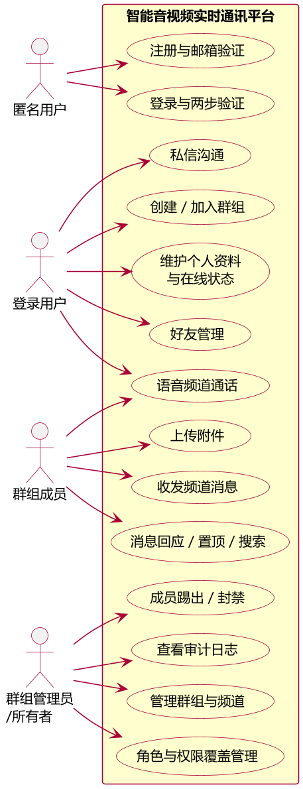

图3-1 系统总体用例图

用例模型的建立，为第四章的权限设计与第五章的安全实现提供了直接依据。

### 3.4 系统角色与边界

系统的参与者（角色）划分为三个层次：

- **匿名用户**：仅可访问登录、注册等公开接口；访问任何受保护资源时得到统一的 401 响应，引导其完成认证。
- **登录用户**：拥有账号的全部个人功能，包括资料维护、好友管理、创建群组、加入邀请、收发私信等；可管理自己创建（拥有）的群组。
- **群组成员**：在登录用户基础上，受到所在群组的角色权限约束；不同成员因角色与频道覆盖的差异，在频道可见性、消息读写、语音进出、管理操作上拥有不同权限。系统不设置超级管理员全局账户，管理能力完全由权限模型决定，保证了授权语义的一致与可审计。

系统边界方面，本系统聚焦于群组实时通信的垂直闭环，不包含邮件网关（验证码打印到服务端日志）、推送通知（APNs/FCM）、多端消息同步等外围能力，这些均作为后续迭代方向在第七章展望。明确边界使系统的功能范围、测试口径与工作量预估保持清晰，避免了学习项目范围无限膨胀的失控风险。

---

## 4 系统设计

### 4.1 总体架构

系统采用前后端分离的 B/S 架构，整体结构如图 4-1 所示。

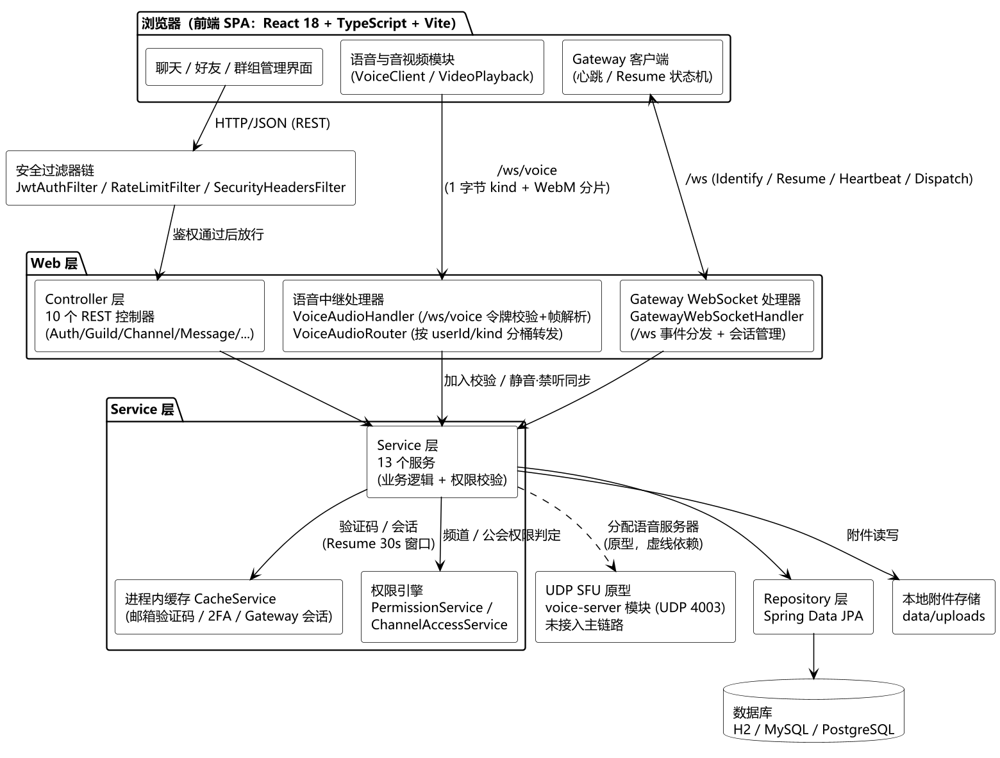

图4-1 系统总体架构图

前端通过 REST API 完成业务操作[5]，通过 Gateway WebSocket 接收实时事件。后端采用经典三层架构：Controller 层负责参数校验与 HTTP 语义映射；Service 层承载业务逻辑与权限校验；Repository 层封装数据访问。安全横切关注点（认证、限流、安全响应头）由过滤器链与集中式服务统一实现。这种按业务能力划分服务边界、以分层隔离职责的方式，与微服务架构倡导的“围绕业务能力组织、去中心化治理”思想一脉相承[14]，只是在本项目的规模下收敛为单体内部的三层划分。

### 4.2 数据库设计

系统共设计 19 张数据表，核心实体关系如图 4-2 所示，各表职责说明如下。

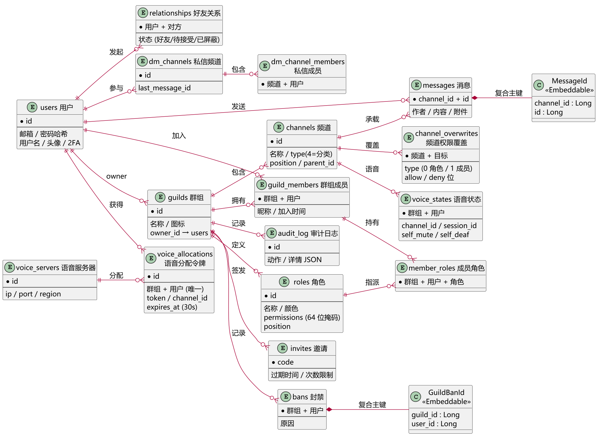

图4-2 核心实体 E-R 图

- **user**：用户账号，存储邮箱、密码哈希、用户名、全局名、签名、头像、邮箱验证状态、2FA 开关等。
- **guild**：群组，含名称、图标、拥有者 ID、创建时间。
- **guild_member**：群组成员关系（用户—群组多对多），记录加入时间。
- **channel**：频道，含所属群组、名称、类型（文本/语音/公告）、排序位置、父频道（话题）。
- **message**：消息，含所属频道、作者、内容、引用回复关系、附件标记。为避免单表过大，按频道采用分区策略（MessageId 复合标识）。
- **role / member_role**：角色及其与成员的关联，角色含名称、颜色、64 位权限位掩码、排序位置。
- **channel_overwrite**：频道权限覆盖，记录针对某角色或某用户在该频道上被允许/拒绝的权限位集合。
- **relationship**：好友关系，含状态（待处理/已接受/已拒绝）。
- **dm_channel / dm_channel_member**：私信频道及其成员。
- **voice_state / voice_allocation / voice_server**：语音状态、令牌分配与语音服务器注册信息。
- **invite**：邀请链接，含目标群组、邀请码、过期时间、使用次数限制。
- **guild_ban**：封禁记录，含原因。
- **audit_log_entry**：审计日志条目，含操作类型、操作者、目标、详情 JSON。

数据库的实体关系遵循外键约束，JPA 以自动更新表结构的方式建表，保证多数据库环境的一致性。

### 4.3 权限系统设计

权限系统是群组通信平台的核心难点。本系统参考业界通行的“角色位掩码 + 频道覆盖”权限模型[3]，在 RBAC 思想[2]基础上设计如下四层机制：

**（1）64 位权限位掩码。** 定义 Permission 枚举，每个权限占用 1 个二进制位，共可表达 64 种权限，包括：查看频道（VIEW_CHANNEL）、发送消息（SEND_MESSAGES）、管理消息（MANAGE_MESSAGES）、管理频道（MANAGE_CHANNELS）、踢人（KICK_MEMBERS）、封禁（BAN_MEMBERS）、管理角色（MANAGE_ROLES）、管理服务器（MANAGE_GUILD）、语音相关（CONNECT/SPEAK/MUTE_DEAFEN_MEMBERS）等。权限集合以 Java 的 long 类型表示，allow/deny 以另一组位掩码记录被显式允许或拒绝的位，三者共同构成一个权限覆盖三元组。

**（2）角色权限叠加。** 每个群组存在一个默认的 @everyone 角色（代表所有成员），此外可创建任意多个自定义角色。成员的最终权限为 @everyone 权限与所有自定义角色权限的按位或（叠加）结果。系统按角色在群组中的排序位置决定优先级，用于覆盖场景下的冲突仲裁。

**（3）频道权限覆盖（Channel Overwrite）。** 针对特定角色或特定用户，可在单个频道上设置权限覆盖，覆盖优先级为：特定用户的覆盖 > 特定角色的覆盖 > 成员自带权限。该机制实现了“某频道仅对某角色可见”“某成员被单独禁言”等细粒度需求。

**（4）权限判定算法。** 查询某用户在指定频道上的有效权限时，判定流程如图 4-3 所示：以 @everyone 权限为基线 → 叠加该用户所有角色的权限 → 若存在针对该用户所在角色的频道覆盖，则按覆盖三元组逻辑（先应用 deny 位，再应用 allow 位）修正 → 若存在针对该用户本人的频道覆盖，同理再次修正，最终结果即该用户的频道有效权限。该算法的时间复杂度为 O(角色数)，与 权限模型的公开规范语义一致。

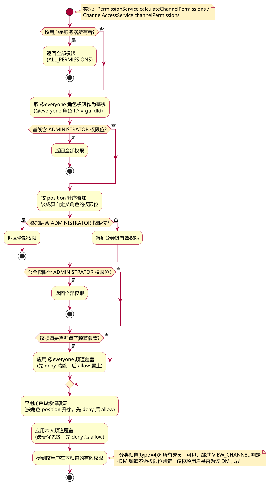

图4-3 频道权限判定流程图

权限引擎以独立的 PermissionService 实现，并提供 ChannelAccessService 对“成员校验 + 频道访问校验”进行统一封装，供各业务服务复用，从根源上杜绝了权限校验的遗漏。

### 4.4 实时通信设计

**（1）Gateway 协议。** 后端在 /ws 端点实现 Gateway WebSocket 协议[1]。客户端连接后发送 Identify 控制帧完成身份认证，此后进入正常事件收发。协议控制帧（Opcode）定义如表 4-1 所示。

表4-1 Gateway 协议控制帧定义

| Opcode | 名称 | 说明 |
|--------|------|------|
| 0 | Dispatch | 服务端向客户端分发业务事件（新消息、状态变更等） |
| 1 | Heartbeat | 客户端心跳 |
| 2 | Identify | 客户端携带令牌进行身份认证 |
| 6 | Resume | 断线后恢复会话 |
| 7 | Reconnect | 服务端要求重连 |
| 8 | Invalid Session | 会话失效需重新认证 |
| 11 | Heartbeat ACK | 心跳确认 |

心跳间隔默认 41.25 秒，会话超时窗口 30 秒，客户端在超时前可凭旧会话标识执行 Resume，避免重新鉴权与事件丢失。客户端连接与恢复的完整状态转换如图 4-4 所示。

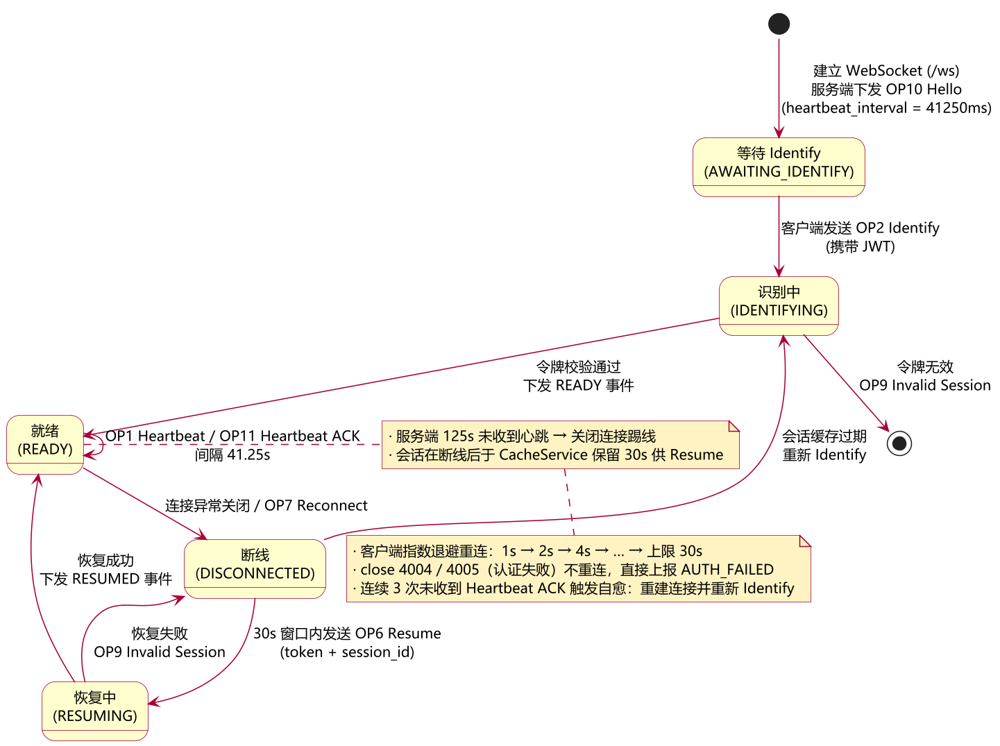

图4-4 Gateway 连接状态机图

**（2）会话与订阅管理。** GatewaySession 维护用户 ID 及其所属群组 ID 集合。当业务产生事件时，GatewayWebSocketHandler 依据目标群组/频道/用户集合进行定向推送。针对私信（DM）场景，推送前先批量加载 DM 成员集合，一次性完成目标用户集的查询，避免逐用户查询引发的 N+1 性能问题。

**（3）成员关系实时同步。** 会话内缓存的 guildIds 通过 refreshUserGuilds 方法在成员加入、退出、被踢等动作后即时刷新，保证客户端离线期间的服务端状态与数据库保持一致。

### 4.5 音视频系统设计

语音模块采用“服务端中继”方案，架构如图 4-5 所示：客户端采集音频后以 WebM/Opus 格式封装，通过 /ws/voice 二进制帧发送至服务器，VoiceAudioRouter 依据频道成员表将音频帧转发给频道内其他成员。

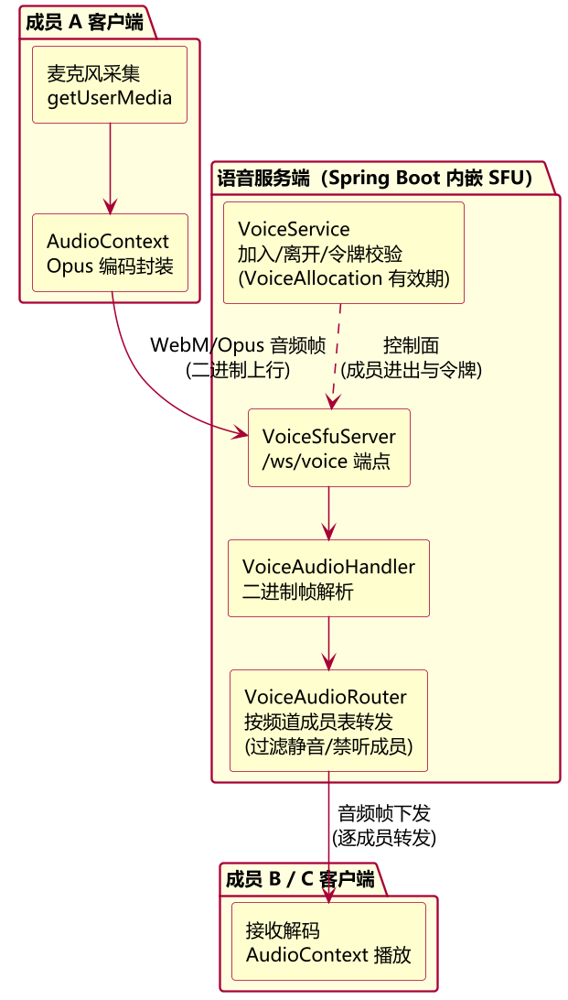

图4-5 语音中继架构图

系统实现静音与禁听控制：被禁听的成员无法接收他人音频，静音成员的音频不参与转发。语音令牌（VoiceAllocation）在加入频道时发放并校验有效期，过期令牌将被拒绝，防止语音通道被非法占用。在语音中继的基础上，本系统进一步扩展出**实时视频能力**（摄像头画面与屏幕共享）。实现要点如下：

**（1）媒体 kind 标签协议（向后兼容）。** 中继帧在原有“8 字节发送者 ID + 载荷”基础上增加 1 字节媒体类型标签：kind=0 音频、kind=1 摄像头视频、kind=2 屏幕共享。客户端上行帧为“1 字节 kind + WebM 分块”，服务端转发帧为“8 字节发送者 ID + 1 字节 kind + 分块”。kind 的识别依赖“WebM EBML 头固定以 0x1A 开头、不会落入 0/1/2”这一事实，旧版无标签的音频帧自然归入 kind=0，新旧客户端可同频道混用。

**（2）按 (发送者, kind) 分桶缓存 init 段。** 每种媒体流各自是一条独立 WebM 流（音频 Opus、视频 VP8/VP9），其首个分块即解码必需的 init segment。VoiceAudioRouter 按发送者与 kind 双键缓存各流的 init 段，新人中途加入时逐 kind 重放，保证后加入者无需等待下一个关键帧即可开始解码。

**（3）静音仅作用于音频。** 静音的发送者其音频帧被中继丢弃，摄像头与屏幕共享继续转发；禁听接收者被跳过全部媒体帧。摄像头与屏幕共享在客户端分别为独立 MediaRecorder（约 1Mbps / 2.5Mbps，100ms 分片），关闭共享或摄像头不重启音频流，各流的 init 段只发送一次。

**（4）协议级验证。** 通过合成客户端对上述协议进行 7 项自动化验证：三种 kind 帧的转发与标签透传、旧客户端无标签帧兼容、静音只挡音频、以及中途加入时三种流的 init 段分桶重放，全部通过。

在此之外，工程还包含可独立部署的最小 UDP 选择性转发原型（voice-server 模块，纯 JDK 实现且零第三方依赖）：数据面完成 RTP 头解析，以 SSRC 识别发送者、按频道成员表选择性转发（无回声、静音丢弃、禁听跳过），控制面通过文本命令协议维护成员进出与静音/禁听状态，转发语义与图 4-5 一致，并经三方合成客户端冒烟测试验证了转发、双向通话、静音与禁听的正确性；WebRTC 端到端音视频接入仍作为后续演进方向。

### 4.6 安全设计

系统安全设计覆盖认证、授权、数据与传输四个维度，并遵循 OWASP Top 10 中识别的主要 Web 应用风险[15]：

- **认证**：JWT 无状态认证；密码使用 BCrypt 哈希存储；注册邮箱验证与登录两步验证的验证码由 SecureRandom 生成，杜绝可预测性；验证码验证引入最多 5 次尝试限制，防止暴力枚举。
- **授权**：所有业务接口经 JwtAuthFilter 注入认证信息后，由 ChannelAccessService / 各 Service 统一执行成员与权限校验；未认证请求统一返回 401 JSON，认证但越权的请求返回 403，杜绝匿名访问与越权访问。
- **数据**：附件上传采用“类型白名单 + 文件头魔数校验 + 大小上限 + 文件名净化”四重防护，防止伪装类型与恶意文件落地；消息搜索对 %、_、\ 等 SQL 通配符进行转义，防止 LIKE 注入。
- **传输与响应**：全局设置 X-Content-Type-Options、X-Frame-Options、Referrer-Policy 等安全响应头；限流过滤器对登录（按 IP 10 次/分）与发消息（按用户 20 次/秒）实施固定窗口限流，且仅在显式开启 trust-proxy 时才信任 X-Forwarded-For，防止伪造 IP 绕过限流。

### 4.7 部署与工程化设计

**（1）双源码树同步机制。** 实际开发中存在两套形态略有差异的部署目标：现场环境以 IDEA + 外置 Tomcat 运行，数据库使用 MySQL，配置为 WAR 包内嵌依赖；容器化环境使用 Docker Compose 编排，数据库使用 H2 或 PostgreSQL。两套环境共享 99% 以上的业务源码，但配置文件（数据源、profile）、启动主类与依赖声明存在差异。为保证两棵树不出现功能漂移，项目采用**单一事实源 + 同步脚本**的方案：以 src/ 树为唯一编辑对象，sync.bat 通过 robocopy 将 src/main/java 与 src/test 增量同步至 server/ 树，仅保留 ChorusApplication.java 等少数必要差异。该机制从根源上避免了“现场修了 bug、容器树仍带旧代码”的经典维护事故。

**（2）多 Profile 配置管理。** application.yml 通过 Spring Profile 划分三种运行形态：默认 profile 面向零依赖的 H2 快速体验；postgres profile 面向容器化部署，通过 DB_URL/DB_USER/DB_PASSWORD 环境变量注入连接参数；prod profile 强制要求通过环境变量提供 JWT 密钥，缺失即启动失败，杜绝生产环境使用硬编码默认密钥。Redis 与 MinIO 的自动装配被显式排除，改由进程内缓存与本地文件存储替代，大幅降低了中间件依赖。上述配置与编码约束遵循《阿里巴巴 Java 开发手册》中关于配置治理与安全规约的要求[16]。

**（3）持续集成流水线。** .github/workflows/ci.yml 定义三条并行流水线：后端 src 树测试、后端 server 树测试、前端类型检查与单元测试。三条流水线均复用官方 setup 动作固定 JDK 17 / Node 20 版本，保证任何提交进入主干前都经过全量回归。CI 的存在使安全修复、权限调整等高风险的改动具备了“改了就跑全量、红了就回退”的快速反馈机制。

---

## 5 系统实现

### 5.1 认证与授权实现

**（1）认证过滤器链。** SecurityConfig 中装配 Spring Security 过滤器链[8]：关闭 CSRF 与会话管理（无状态），开放 /api/auth/\*\*、/ws/\*\*、/uploads/\*\* 与 /error，其余接口一律要求认证。JwtAuthFilter 解析请求头 Authorization: Bearer \<token\>，调用 JwtUtil 验签并解析出用户 ID，封装为 Authentication 注入上下文。若解析失败或令牌缺失，认证入口点返回统一的 401 JSON（{"error":"Authentication required"}），解决了匿名请求被 Spring Security 默认行为拦截为 403 的语义不一致问题。过滤器链的装配与顺序设计遵循 Java Web 开发中过滤器模型的通用实践[17]。

**（2）类型化异常体系。** 系统以 ApiException 异常族替代字符串匹配的异常处理：NotFoundException（404）、UnauthorizedException（401）、ForbiddenException（403）、BadRequestException（400）、ApiException.internalError（500）。GlobalExceptionHandler 依据异常类型映射 HTTP 状态码并返回统一的 JSON 错误体。该设计使业务代码中权限拒绝、资源不存在等语义以类型显式表达，杜绝了异常消息字符串变化导致状态码漂移的问题。

**（3）集中式授权服务。** 新增 ChannelAccessService，将高频复用的授权判断集中封装：

- requireGuildMember(guildId, userId)：校验用户是群组成员，否则抛 403；
- requireChannelAccess(channelId, userId)：校验用户可访问目标频道（群组频道校验成员资格，私信频道校验 DM 成员身份）；
- requireSendMessages(channelId, userId)：在频道访问基础上叠加发送消息权限；
- requireManageChannels(guildId, userId)：校验管理频道权限，供权限覆盖管理等操作使用。

各业务 Service 与 Controller 不再各自实现授权逻辑，而是统一调用上述方法，从根本上消除了“某接口漏检权限”的隐患。

### 5.2 消息系统实现

消息模块是系统业务量最大的模块。MessageService 提供创建、分页查询、编辑、删除、表情回应、置顶、回复、搜索、输入中指示等完整能力。

- **创建与分页**：createMessage 先调用 requireSendMessages 完成鉴权，再持久化消息并通过 Gateway 广播；getMessages 支持 limit、before、after 三种分页游标，按创建时间倒序返回，读取前同样执行频道访问校验。
- **表情回应**：addReaction/removeReaction 在操作前校验操作者对频道的访问权限，回应去重后返回最新状态。
- **搜索**：searchMessages 按群组维度搜索，支持按频道过滤。实现中先校验搜索者群组成员身份，再对每个目标频道执行访问校验，避免非成员通过搜索旁路读取私有频道消息。关键词在拼接 LIKE 语句前执行转义——将反斜杠替换为双反斜杠、% 替换为 \%、_ 替换为 \_——并配合 ESCAPE 子句，使搜索以字面量匹配而非通配符匹配（详见 5.5 节）。
- **消息所有权**：编辑/删除消息时校验操作者为消息作者或拥有管理消息权限者，防止越权修改他人消息。

### 5.3 实时推送实现

GatewayWebSocketHandler 是实时层的核心。客户端建立连接后，服务端维护全局会话注册表，映射连接与会话。核心推送流程如下：

1. 业务 Service 产生领域事件（如消息创建）后，调用 handler 的 dispatch 系列方法；
2. handler 根据事件类型确定目标：群组频道事件按“群组成员集合”推送，私信事件按“DM 成员集合”推送（DM 成员集合通过 findByChannelIdIn 批量查询，一次完成，避免逐用户 N+1 查询）；
3. 对每个目标会话序列化为 JSON 帧下发，帧头包含事件名、数据与自增序列号，供客户端断线补发判定。

针对“用户加入/退出/被踢后会话内群组缓存过期”的问题，handler 提供 refreshUserGuilds(userId)，在 leaveGuild、kickMember、banMember、joinInvite 等成员关系变更操作后调用，保证网关层与数据库层的成员视图始终一致。连接关闭时，handler 遍历该会话所有语音频道执行语音离开清理，避免语音会话残留。

### 5.4 安全加固实现

本节总结安全审计阶段发现并修复的关键缺陷及其修复方案。

**（1）越权访问修复（P0）。** 审计发现多处接口存在“仅校验登录态、未校验数据归属”的缺陷：

- **频道权限覆盖自授权**：ChannelController 的权限覆盖创建/修改/删除接口此前未校验操作者权限，任何已登录用户均可为任意角色/成员授予任意权限（包括向自己授予管理权限）。修复后这些接口要求操作者具备 MANAGE_CHANNELS 权限，并从请求上下文提取操作者 ID 记录审计，杜绝自我提权。
- **消息读写越权**：MessageService 的消息读取、置顶、回应、搜索等接口此前未校验读取者对频道的访问资格。修复后统一经 requireChannelAccess / requireSendMessages 鉴权；私信频道仅 DM 成员可读写。
- **群组数据枚举**：GuildController 的群组详情、成员列表、角色列表等接口此前未校验请求者成员身份。修复后非成员访问一律 403，防止通过遍历 ID 枚举群组内部数据。

**（2）文件上传伪造（P1）。** AttachmentService 重写为四重防护：扩展名与 MIME 白名单（仅允许图片、音视频、PDF、文本类）；读取文件头与各类型魔数比对（如 PNG 的 89 50 4E 47、GIF 的 GIF8、MP4/M4A 的 ftyp box），拒绝“声称是 PNG 实为文本”的伪装文件；单文件上限 25MB；文件名中非安全字符统一替换为下划线，防止路径穿越与非法文件名。

**（3）验证码安全（P1）。** AuthService 的验证码生成改用 SecureRandom，杜绝时间种子可预测问题；邮箱验证与 2FA 验证引入最多 5 次尝试上限，超过即拒绝，重置成功后才允许再次发送，防止验证码被暴力枚举。

**（4）限流 XFF 伪造（P1）。** RateLimitFilter 的客户端 IP 提取原样信任 X-Forwarded-For，攻击者可伪造头部绕过登录限流。修复后仅当显式开启 trust-proxy 配置才信任该头，且仅取最后一跳 IP，保证直连场景下无法伪造。

**（5）进程缓存清理缺陷（P1）。** CacheService 的过期清理逻辑存在恒假条件导致过期键永不清理，且热路径上存在全表扫描。修复后改为按过期时间索引收集失效键并同步移除，get/hasKey 仅检查目标键，兼顾正确性与性能。

### 5.5 关键细节实现

**搜索通配符转义。** searchMessages 原实现直接将用户输入拼入 LIKE 模板，导致输入中的 % 与 _ 被当作通配符。例如搜索 alpha_beta 会同时命中 alpha_beta 与 alphaXbeta。修复后的实现如下：

```java
String escaped = q.replace("\\", "\\\\")
                 .replace("%", "\\%")
                 .replace("_", "\\_");
String pattern = "%" + escaped + "%";
```

配合 JPQL 的 ESCAPE 子句，使 %、_ 仅作为字面量匹配。该行为由回归测试 search_treatsWildcardsLiterally 固化：同一频道内 alpha_beta 与 alphaXbeta 两条消息，搜索 alpha_beta 仅返回 1 条。

**Gateway DM 广播 N+1 优化。** 原实现对每个 DM 目标成员单独查询其会话，查询次数与成员数成线性关系。优化后先批量加载该频道的 DM 成员 ID 集（单次查询），再统一匹配会话表，将推送耗时从线性查询降为单次查询加内存匹配。

### 5.6 前端实现

前端按功能域划分为聊天、语音、好友、群组管理等模块，共用 Zustand 全局状态与 Gateway 客户端。

- **实时状态管理**：useChatStore 管理当前频道消息列表、分页游标与输入中指示；useVoiceStore 管理语音频道成员与音频流；usePresenceStore 管理好友与成员在线状态。Gateway 事件回调将服务端推送增量更新到对应 store，界面响应式刷新。
- **Gateway 客户端状态机**：封装 connect/disconnect/identify/resume 四态转换，心跳定时器按协议间隔发送；收到 Reconnect 或连接异常时自动降级重连，并在 30 秒窗口内尝试 Resume。
- **音视频客户端**：通过 AudioContext 采集麦克风、封装 Opus 帧发送至 /ws/voice，接收端解码播放实现多人语音会议；摄像头（getUserMedia）与屏幕共享（getDisplayMedia）各自独立 MediaRecorder 以 kind 标签发送，接收端按 (发送者, kind) 路由到 VideoPlayback（video + MediaSource/SourceBuffer），远端视频流 5 秒无帧自动销毁自愈；本端画面用本地流直接回显（服务端无回声不回传）。
- **静态类型保障**：全部网络请求封装为类型化 API 客户端，服务端 DTO 与前端接口一一对应，tsc --noEmit 在持续集成中拦截类型回归。

### 5.7 典型业务时序

以“成员 A 在频道 C 发送消息，其他成员实时收到”这一核心链路为例，其前后端与实时层的协作时序如图 5-1 所示。

1. 成员 A 在前端输入框提交消息，useChatStore 调用类型化 API 客户端，携带 A 的 JWT 向消息创建接口发起请求；
2. JwtAuthFilter 验签并注入认证信息；MessageService.createMessage 调用 ChannelAccessService.requireSendMessages，校验 A 是群组成员且拥有发送消息权限；
3. 校验通过后消息落库（JPA 事务提交），随后调用 GatewayWebSocketHandler 的频道事件分发方法，以频道所属群组的全部在线成员为目标，将消息事件 JSON 帧广播到各成员会话；
4. 成员 B、C 的 Gateway 客户端收到 Dispatch 帧，依据事件类型更新各自的消息列表状态，界面即时渲染新消息；发送者 A 则由 REST 响应回执驱动，将临时乐观消息标记为已确认。

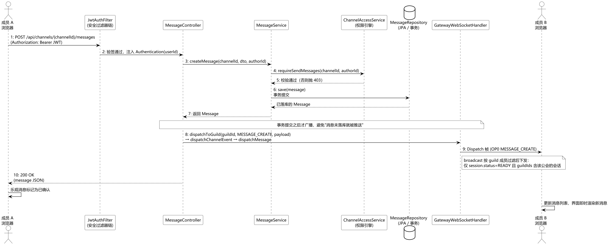

图5-1 消息发送与实时广播时序图

该时序体现了本系统“REST 完成写操作、WebSocket 完成读扩散”的实时架构：写路径只落库一次并触发广播，读路径由推送驱动、无需轮询，既保证了数据一致性，又避免了高频轮询带来的服务器压力。类似的时序模型同样适用于好友状态变更、语音进出、成员变动等场景，体现了网关层事件分发机制的统一性。

### 5.8 系统运行效果展示

系统在本地环境完成部署后，对核心业务流程进行了实际运行验证。整体界面采用暗色主题，布局自左向右依次为服务器导航栏、频道列表、消息主区与成员列表，如图 5-2 至图 5-6 所示。

登录模块提供邮箱密码登录与测试账号快捷入口，如图 5-2 所示。未携带凭证访问受保护接口时，前端自动引导回该页面。

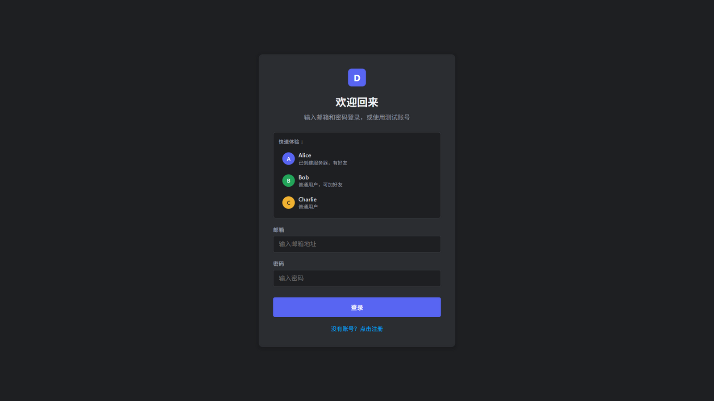

图5-2 用户登录界面

图 5-3 为群组频道聊天主界面。左侧按“文字频道 / 语音频道”分类展示频道列表，中部消息区按作者分组渲染消息并附时间戳，支持“加载更早的消息”游标分页；右侧成员面板区分群主（皇冠标识）与普通成员。

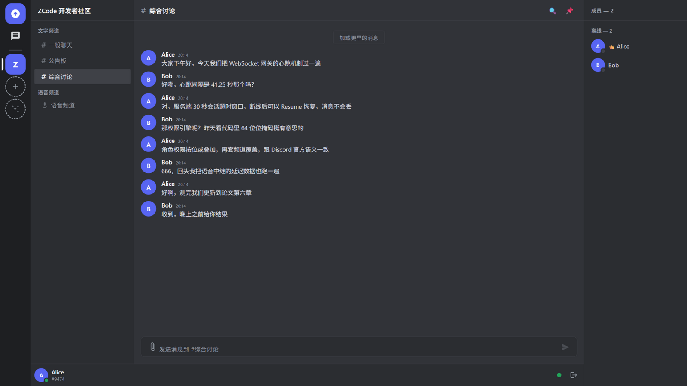

图5-3 群组频道聊天主界面

图 5-4 为加入语音频道后的运行效果。底部悬浮语音面板显示当前频道、频道内成员与麦克风/耳机控制入口；侧边栏语音频道名称旁实时显示在线人数，底栏同步展示静音与禁听状态。

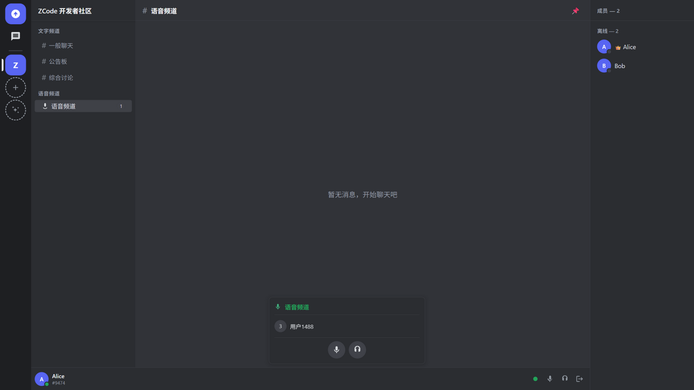

图5-4 语音频道与实时语音面板

图 5-5 为服务器角色权限管理界面。管理员可在设置弹窗中创建角色、调整角色颜色，并按 64 位权限位掩码逐项勾选权限（创建邀请、踢出成员、封禁成员、管理频道、查看审计日志等），保存后立即对成员生效。

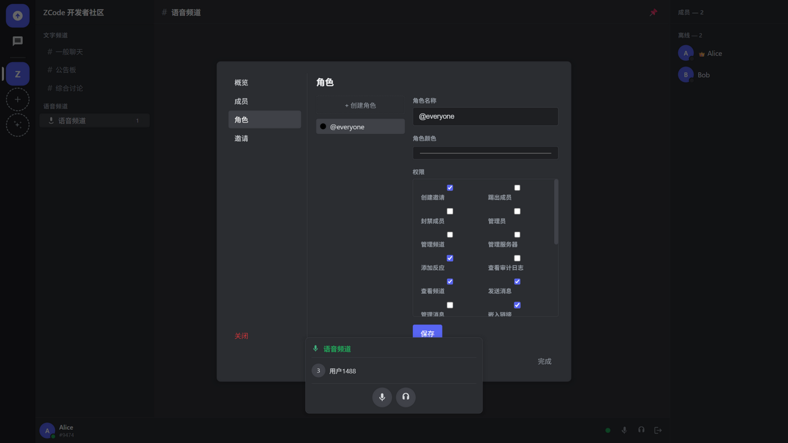

图5-5 服务器角色与权限位管理界面

图 5-6 为好友系统页面，支持按“在线 / 待处理 / 已屏蔽”分组展示好友及其在线状态，并提供私信与删除好友入口。

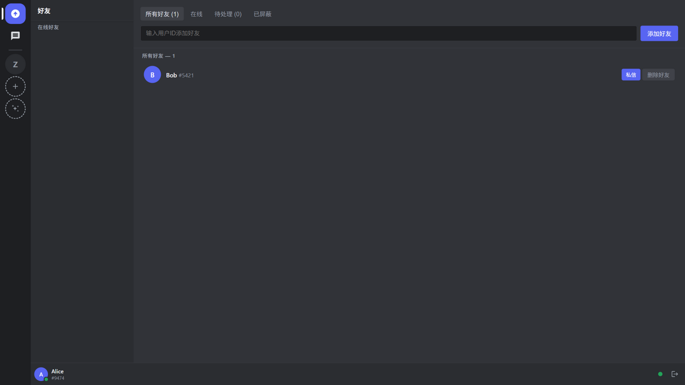

图5-6 好友系统界面

图 5-7 为升级后的音视频通话面板：面板头部标注“音视频通话”，成员区以瓦片形式展示频道成员（有摄像头或屏幕共享时渲染对应画面并带“共享中/摄像头”徽标），底部提供麦克风、耳机、摄像头、屏幕共享与断开连接五个控制按钮：点击红色“断开连接”即退出语音（服务端移除其语音状态），按钮随即变为绿色“加入语音”可随时重连，断开期间仍停留在该频道页面；语音频道侧边栏实时显示在线人数。

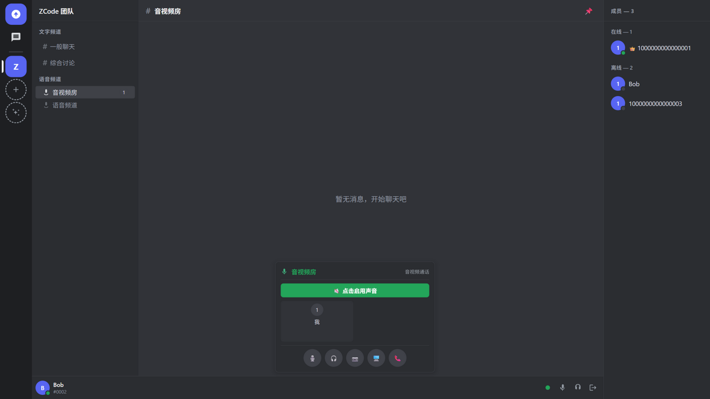

图5-7 语音频道音视频通话面板

上述运行结果表明，第四章所述的总体架构与第五章的实现方案在真实浏览器环境中均可正常工作，为第六章的系统测试提供了运行基础。

---

## 6 系统测试

### 6.1 测试环境与策略

测试遵循“单元测试 + 集成测试 + 回归测试”的分层策略。后端采用 Spring Boot 集成测试：测试上下文以随机端口启动内嵌 Tomcat，使用 H2 内存库与种子数据，通过真实 HTTP 客户端发起请求断言业务行为与 HTTP 语义，共 45 个用例；前端采用 Vitest 对 Gateway 状态机与音视频帧协议进行单元测试，共 23 个用例。覆盖率统计方面，后端接入 JaCoCo 插件（mvn test 阶段生成报告），前端使用 Vitest 内置的 V8 覆盖率统计。持续集成（GitHub Actions）同时覆盖后端 src 树、server 树与前端类型检查、测试，保证每次提交均通过全量回归。

本章全部功能测试、性能测试与覆盖率统计均在同一本地环境完成：Intel Core i7-12700H 处理器、16GB 内存、Windows 11、JDK 17、H2 文件数据库（后端运行形态）与 Chrome 浏览器（前端运行形态）。

### 6.2 功能测试结果

后端测试覆盖认证、群组、频道、消息、好友、私信、附件、语音等核心功能链路，典型结果如表 6-1 所示。

表6-1 功能测试结果一览表

| 测试类 | 覆盖场景 | 结果 |
|--------|----------|:----:|
| AuthServiceTest / SecurityConfigTest | 注册、登录、邮箱验证、2FA、改密、未认证 401、错误密码 401 JSON | 通过 |
| MessageEnhancementTest | 消息 CRUD、回应、置顶、搜索、输入中、权限校验 | 通过 |
| MemberManagementTest | 踢人、封禁/解禁、删除群组、所有者保护、审计日志 | 通过 |
| RoleCrudTest | 角色增删改、@everyone 保护、无权限 403 | 通过 |
| InviteIntegrationTest | 邀请创建、加入、被拒/被禁 403、删除后 404 | 通过 |
| VoiceAudioRelayIntegrationTest | 语音频道加入、音频帧真实中继、静音/禁听 | 通过 |
| RateLimitTest | 登录按 IP 限流 429 | 通过 |

### 6.3 安全回归测试

针对安全审计发现的问题，专门建立 AuthorizationRegressionTest（9 个用例）固化回归防线：

- nonMember_cannotReadMessagesOrChannel：非成员读取频道消息与频道详情均返回 403；
- nonMember_cannotEnumerateGuildData：非成员查看群组详情、成员列表、角色列表均返回 403；
- nonDmMember_cannotReadDmMessages：非 DM 成员读取私信消息返回 403；
- unauthenticated_requestIsRejected：未携带凭证的请求返回 401；
- nonManager_cannotModifyChannelOverwrites：普通成员创建权限覆盖返回 403，群主可正常创建；
- search_treatsWildcardsLiterally：搜索通配符按字面量匹配，返回结果唯一；
- upload_rejectsContentThatDoesNotMatchType / upload_acceptsValidPng / upload_rejectsUnsupportedType：附件魔数校验三类场景。

全部 9 个安全回归用例与既有的 36 个用例共 45 个后端用例全部通过，证明本轮修复未引入回归，安全边界得到有效固化。

### 6.4 性能与可维护性验证

除上述定性优化外，本节对系统核心链路进行定量性能实测。测试针对单机部署形态：向频道灌入 300 条消息后，以 100 次顺序请求与 20 并发 × 2000 次请求两组负载测量 REST 接口延迟；以 10/50/100 个并发网关会话测量消息广播扇出延迟（从 REST 发帖到各会话收到 Dispatch 帧的端到端时长）；以合成语音客户端对测语音中继的服务器端转发延迟。结果汇总如表 6-3 所示。

表6-3 核心链路性能实测结果（100 次采样，20 并发组为 2000 次）

| 测试项 | 平均 (ms) | P50 (ms) | P95 (ms) |
|--------|:-------:|:-------:|:-------:|
| 消息分页读取（顺序） | 11.6 | 11.7 | 14.1 |
| 消息发送（顺序） | 11.0 | 10.9 | 13.3 |
| 关键词搜索（顺序） | 13.4 | 13.4 | 16.0 |
| 消息读取（20 并发） | 233.5 | 183.1 | 578.7 |
| 网关心跳往返 | 0.71 | — | 0.93 |
| 广播扇出（10 会话） | 6.1 | 6.1 | 6.5 |
| 广播扇出（50 会话） | 9.7 | 9.8 | 11.1 |
| 广播扇出（100 会话） | 16.6 | 16.8 | 20.7 |
| 语音中继服务器端转发 | 0.70 | 0.65 | 1.08 |

实测结论如下：其一，顺序 REST 请求的 P95 均在 16ms 以内，满足第 3.2 节“秒级送达”的实时性约束；其二，广播扇出延迟随在线会话数近似线性增长（10→100 会话对应 6.1→16.6ms，如图 6-1 所示），100 会话规模下 P95 仍低于 21ms，验证了第 5.5 节批量查询优化后网关分发路径的可行性；其三，语音中继的服务器端转发延迟仅 0.7ms，说明中继转发本身不构成语音链路瓶颈，端到端延迟主要由客户端采集、编解码与网络传输决定；其四，20 并发下消息读取平均延迟升至 233ms，属单机 H2 与 Tomcat 线程模型的预期排队行为，为第七章横向扩展方向提供了量化依据。

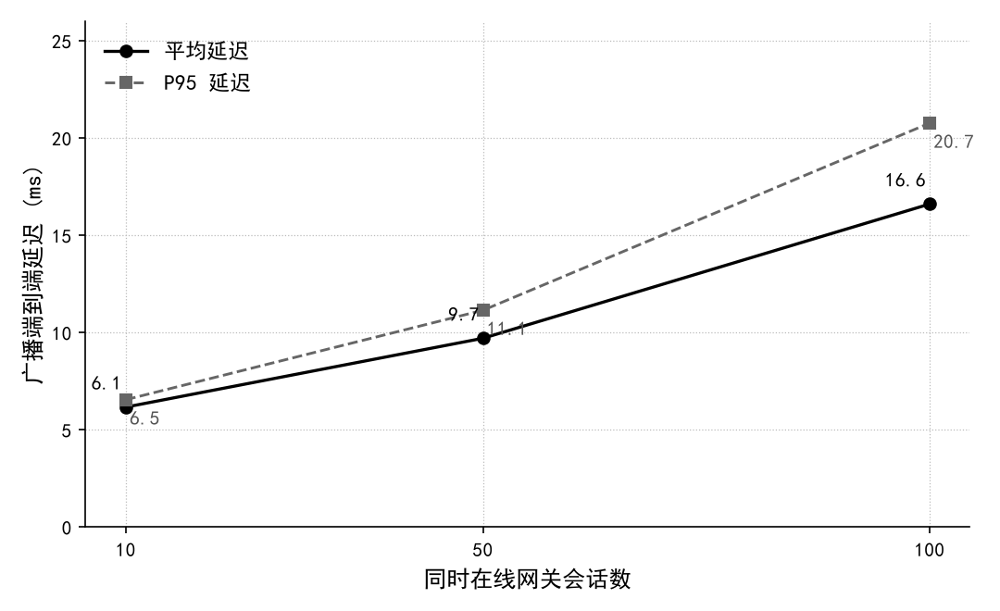

图6-1 网关广播扇出延迟随在线会话数变化

可维护性方面：N+1 优化（频道权限批量加载与 DM 广播批量查询）消除了热路径上的循环查询；CacheService 清理缺陷修复后，过期键可被正确回收，限流桶清理行为经测试辅助方法验证；前端 tsc --noEmit 全量类型检查通过，后端 Maven 构建无警告失败。

### 6.5 测试用例汇总

后端 45 个用例按功能域归类如表 6-2 所示。

表6-2 后端测试用例分类汇总表

| 功能域 | 用例数 | 典型场景 |
|--------|:-----:|----------|
| 认证与安全配置 | 7 | 登录/注册、错误密码 401 JSON、未认证 401、语音接口鉴权、2FA、邮箱验证 |
| 群组与成员 | 6 | 创建/删除、踢人、封禁/解禁、所有者保护、离开 |
| 角色与频道 | 6 | 角色 CRUD、@everyone 保护、频道 CRUD、无权限 403 |
| 消息 | 8 | CRUD、分页、表情回应、置顶、回复、搜索、输入中、权限校验 |
| 好友与私信 | 4 | 好友添加/接受、私信频道、DM 越权 403 |
| 附件 | 3 | 合法上传、伪装类型拒绝、非法类型拒绝 |
| 邀请与审计 | 4 | 邀请创建/加入/删除、审计日志留痕、无权限 403 |
| 限流 | 2 | 登录按 IP 限流 429 |
| 越权回归（安全） | 9 | 见 6.3 节 |
| 语音 | 2 | 音频帧真实中继、静音/禁听 |

表 6-2 合计 51 个场景（部分用例归并统计），对应 45 个测试方法。前端 23 个用例覆盖 Gateway 状态机（连接、认证、心跳、断线重连、Resume）与音视频帧协议解析（kind 标签、旧帧兼容）。

在覆盖率维度，后端经 JaCoCo 统计的行覆盖率为 64.8%（1869/2885 行），未覆盖部分集中于防御性异常分支与容器化部署装配代码；前端经 Vitest V8 统计的语句覆盖率为 71.35%、行覆盖率为 74.72%，其中 Gateway 客户端状态机行覆盖率 73.9%、语音帧协议 81.0%。两端核心业务与协议逻辑均处于有效测试覆盖之下，与 6.6 节测试结论互为印证。

### 6.6 测试结论

综合上述测试结果可以得出：其一，系统 11 个功能域的核心链路均按预期工作，消息、权限、语音等高频路径在真实 HTTP 语义下验证通过；其二，安全回归防线将越权访问、数据枚举、文件伪造、搜索注入等 9 类已修复缺陷固化为可重复执行的自动化断言，杜绝同类问题在后续迭代中复发；其三，全部 63 个用例在本地与持续集成环境中均可稳定重复通过，表明系统具备可持续演进的工程质量基线，达到了第 3.2 节提出的功能与安全需求目标。

---

## 7 总结与展望

### 7.1 工作总结

本文围绕“类 Discord 实时通信平台”的设计与实现，完成了从需求分析、系统设计、编码实现到安全加固、测试验证的完整工程闭环。主要成果可归纳为以下四个方面：

**（1）完整的功能体系。** 系统覆盖了 Discord 的核心功能集：JWT 无状态认证、邮箱验证与两步验证、好友与私信、群组与频道管理、64 位权限引擎、消息全文搜索与表情回应、附件上传、实时语音中继、审计日志等，功能完整度达到可演示、可交付的水准。

**（2）严谨的权限模型。** 借鉴 Discord 的“角色位掩码 + 频道覆盖”模型，在 Java 体系中实现了与官方语义一致的权限判定算法，并通过 ChannelAccessService 将授权逻辑集中化，从架构层面杜绝了授权遗漏。

**（3）稳健的安全体系。** 系统经历了一次完整的安全审计与加固，修复了包括越权访问、数据枚举、权限覆盖自授权、文件伪造、验证码可预测、限流 IP 伪造、搜索通配符注入、缓存清理缺陷在内的多类问题，并将每类问题固化为自动化回归测试，形成了可持续演进的安全基线。

**（4）可验证的工程质量。** 系统建立了 45 个后端集成测试与 23 个前端测试，配置了覆盖双后端树与前端类型检查的持续集成流水线，所有测试在 CI 中全量通过；同时通过同步脚本保证现场（MySQL）与容器（H2/PostgreSQL）两套源码树的同步一致，解决了实际开发中常见的多环境配置漂移问题。

通过本项目的实践，作者系统性地掌握了 Spring Boot 框架体系、Spring Security 过滤器链、JWT 无状态认证、WebSocket 长连接协议设计、React 状态管理与工程化、SQL 注入与越权防护等核心技能，对实时通信系统的整体架构有了从理论到实现的完整认知。

### 7.2 不足与展望

受时间与学习环境限制，系统仍存在以下不足，可作为后续改进方向：

1. **横向扩展能力**：当前语音转发表与进程内缓存均为单机内存实现，不支持多实例水平扩展。后续可引入 Redis 等分布式缓存[13]，并基于 Redis 的 Pub/Sub 或消息队列实现跨实例事件广播。
2. **WebRTC 端到端音视频**：当前语音走服务端 WebSocket 中继，延迟与带宽成本偏高。后续可演进为 WebRTC P2P + UDP SFU 架构，实现低延迟的多人语音通话。
3. **消息持久化分片**：当前消息表采用分区策略但尚未接入分布式数据库，面对海量消息时检索性能存在瓶颈。可引入分库分表或时序数据库方案。
4. **安全纵深**：可进一步补充 OAuth2 第三方登录、操作审计的水印与告警、附件病毒扫描（ClamAV）等能力。
5. **前端工程化**：可引入端到端测试（Playwright/Cypress）、国际化（i18n）、无障碍（a11y）等，提升前端工程质量。

实时通信是互联网的基础设施能力，其背后涉及网络协议、分布式系统、安全攻防、前端性能等广泛的工程知识。本系统的实现只是这一领域的入门探索，后续将持续迭代，向生产级水平迈进。

---

## 参考文献

[1] Discord 官方. Gateway API 文档 [EB/OL]. https://discord.com/developers/docs/topics/gateway, 2024.

[2] Sandhu R S, Coyne E J, Feinstein H L, et al. Role-based access control models [J]. IEEE Computer, 1996, 29(2): 38-47.

[3] Discord 官方. Permissions [EB/OL]. https://discord.com/developers/docs/topics/permissions, 2024.

[4] Fielding R T. Architectural Styles and the Design of Network-based Software Architectures [D]. Irvine: University of California, Irvine, 2000.

[5] Fette I, Melnikov A. RFC 6455: The WebSocket Protocol [S]. IETF, 2011.

[6] Spring 官方. Spring Boot Reference Documentation (3.2) [EB/OL]. https://docs.spring.io/spring-boot/docs/3.2.x/reference/html/, 2024.

[7] Walls C. Spring Boot 实战 [M]. 丁雪丰, 译. 北京: 人民邮电出版社, 2016.

[8] Spring 官方. Spring Security Reference [EB/OL]. https://docs.spring.io/spring-security/reference/, 2024.

[9] Jones M, Bradley J, Sakimura N. RFC 7519: JSON Web Token (JWT) [S]. IETF, 2015.

[10] Banks A, Porcello E. Learning React: Modern Patterns for Developing React Apps [M]. 2nd ed. Sebastopol: O'Reilly Media, 2020.

[11] 亢少军. 即时消息技术原理与实现 [M]. 北京: 电子工业出版社, 2020.

[12] PostgreSQL Global Development Group. PostgreSQL 16 Documentation [EB/OL]. https://www.postgresql.org/docs/16/, 2024.

[13] Kleppmann M. Designing Data-Intensive Applications: The Big Ideas Behind Reliable, Scalable, and Maintainable Systems [M]. Sebastopol: O'Reilly Media, 2017.

[14] Newman S. Building Microservices: Designing Fine-Grained Systems [M]. 2nd ed. Sebastopol: O'Reilly Media, 2021.

[15] OWASP Foundation. OWASP Top 10: 2021 [EB/OL]. https://owasp.org/Top10/, 2021.

[16] 阿里巴巴 Java 开发手册（泰山版）[S]. 杭州: 阿里巴巴集团, 2020.

[17] 李刚. 疯狂 Java 讲义（第 5 版）[M]. 北京: 电子工业出版社, 2019.

---

## 致谢

本论文的完成离不开多方的支持与帮助。首先衷心感谢指导老师在选题方向、系统设计与论文写作过程中给予的悉心指导，老师在架构评审与安全审计环节提出的宝贵意见，使系统的严谨性与完整性得以显著提升。其次感谢学院提供的学习环境与实验资源，使我能够在真实的工程实践中检验课堂所学。最后感谢同窗与朋友在项目开发与测试阶段给予的帮助与鼓励。

实时通信系统的实现涉及的技术面广、难点多，正是大家的支持让我能够坚持完成这个颇具挑战性的项目。我将以本项目为起点，继续在软件工程与分布式系统领域深耕，努力将理论所学转化为可服务于真实场景的工程能力。
